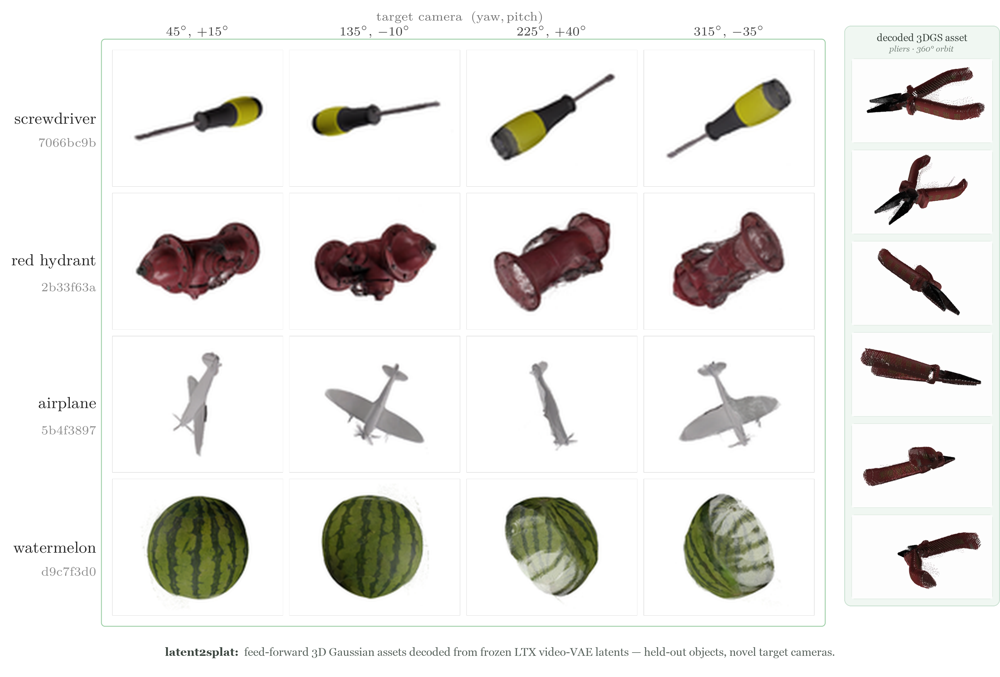
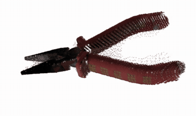
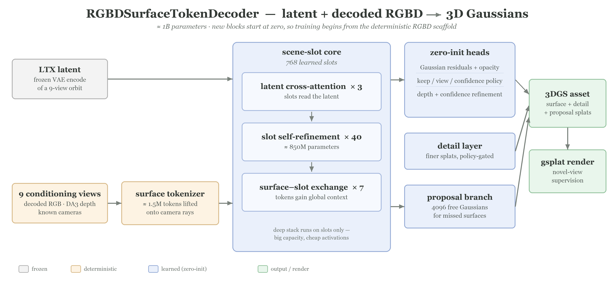

# latent2splat

### Decoding 3D Gaussian Assets from Frozen Video-VAE Latents

[Jason Lee](mailto:lee2025@stanford.edu) · [Yubo Ruan](mailto:yuboruan@stanford.edu) · [Ryan Zhang](mailto:rrzhang@stanford.edu)

Stanford University

<p align="center">
  
</p>

<p align="center">
  
  <br>
  <em>Decoded assets are explicit 3DGS scenes, rendered here along a full 360° orbit.</em>
</p>

## Overview

We study whether the latent space of a frozen, general-purpose video VAE
(LTX-2.3) — with no camera conditioning and no fine-tuning of the backbone —
carries enough 3D structure to support feed-forward reconstruction of explicit
3D Gaussian Splatting (3DGS) assets. Given only the latent produced by encoding
a short object orbit, a decoder must recover geometry, visibility, opacity, and
appearance without per-object optimization.

We find that decoding the latent *directly* into Gaussians consistently
collapses into a translucent-fog equilibrium, while a control experiment with
freely optimized Gaussians shows the data and renderer are not at fault: the
failure is one of decoder parameterization. The latent's content becomes
recoverable once it is re-expressed as multi-view evidence — decoding it back
to orbit RGB with the frozen VAE and pairing each frame with a monocular depth
prior yields a deterministic RGBD-fusion scaffold that reconstructs held-out
objects fog-free at ~21 dB foreground PSNR. Our final model builds on this
observation: a ~1B-parameter slot-based transformer that starts *exactly* at
the deterministic scaffold and learns where to refine, gate, and extend it.

## Contributions

1. **`RGBDSurfaceTokenDecoder` — a ~1B-parameter feed-forward latent-to-3DGS
   decoder.** Roughly 1.5M ray-anchored surface tokens, lifted from the
   frozen-VAE-decoded conditioning views, exchange information with 768 learned
   scene slots that cross-attend to the LTX latent. A 40-layer slot-refinement
   stack concentrates ≈85% of the parameters on the slot tokens alone, scaling
   capacity at near-constant activation cost. Three design decisions are
   central: *(i)* every learned block is zero-initialized and gated, so the
   model's initialization reproduces the deterministic scaffold exactly and
   training can only improve on it; *(ii)* structured policy heads
   (keep / confidence / view / coverage) replace unconstrained opacity
   residuals, which our ablations show otherwise trade sharpness for PSNR; and
   *(iii)* a branch of 4096 free proposal Gaussians — initialized invisible —
   adds geometry where the depth evidence is missing or wrong.
2. **A constructive decoding path for non-camera-conditioned latents.** The
   frozen VAE decode → monocular depth (Depth Anything 3) → deterministic
   surfel-fusion scaffold establishes that general-purpose video latents
   support fog-free, feed-forward 3D reconstruction, and doubles as the
   identity initialization target of the learned decoder.
3. **A characterization of the strict-decoding failure mode.** Direct
   latent→Gaussian decoders fail through an opacity equilibrium in which
   stacked translucent splats satisfy color losses while opacity gradients
   vanish. The analysis and all baseline decoders are preserved
   (`decoder/clean/network.py`, [`legacy/`](legacy/README.md)).
4. **Camera-pose recovery from RGBD orbits.** A lightweight pose head
   (`ConditionPoseHead`) recovers conditioning-view cameras to <0.02° held-out
   error, addressing the future setting in which orbits are *generated* by the
   video model without trustworthy camera metadata.

## Method

```
Objaverse object → 49-frame orbit render
  → frozen LTX-2.3 video VAE encodes 9 evenly spaced frames → latent (128, 2, 36, 24)
  → frozen VAE decode back to orbit RGB        ┐
  → Depth Anything 3 depth per decoded frame   ┤ RGBD conditioning evidence
  → RGBDSurfaceTokenDecoder (~1B params)       ┘
      · sample RGBD views into source surface tokens
      · inject the LTX latent; refine through a deep slot stack
      · learned proposal seeding/anchoring + policy & view-selector heads
      · emit Gaussians (means, scales, quats, RGB, opacity) directly
  → gsplat differentiable rendering
  → foreground-weighted L1 + SSIM + alpha/edge/gradient/depth losses
```

<p align="center">
  
</p>

Deterministically lifted RGBD surface tokens and the LTX latent meet in a
768-slot transformer core. The parameter-heavy refinement stack operates on
slot tokens only, decoupling model capacity from the ~1.5M-token evidence set;
the per-token output heads are zero-initialized, so optimization starts from
the deterministic scaffold rather than from noise. `CanonicalVoxelDecoder`
(~33M parameters, canonical-voxel message passing) is the structured smaller
alternative studied alongside the final model.

## Repository structure

```
decoder/
  clean/                    The system
    surface_token_decoder.py     final ~1B learned surface-token 3DGS decoder
    canonical_voxel_decoder.py   canonical-voxel decoder (smaller alternative)
    fusion.py, geometry.py       deterministic RGBD surfel fusion scaffold (baseline)
    network.py                   strict direct latent→3DGS decoder (baseline)
    fit_freegauss.py, fit_densified_gs.py   per-object optimization ceilings
    train_phase2.py              main training/eval entry point
    decode_ltx_latents.py        frozen LTX VAE latent → RGB sidecars
    predict_depth_da3.py         Depth Anything 3 depth sidecars
    sparse_voxel_fusion.py, condition_refine.py, ...  learned-refiner ablations
  data.py, render.py        dataset + camera conversion, gsplat render wrapper
  tests/                    pytest suite (camera math, fusion, decoders, rendering)
legacy/                     original strict direct latent→3DGS decoders (see legacy/README.md)
modal_phase123.py           Modal harness: data prep, sidecar generation, training/eval
compose.decoder.yml         local Docker Compose runtime (CUDA 13.0 / gsplat / SM 12.0)
docker/Dockerfile.decoder   decoder training image
docker/Dockerfile.da3       + Depth Anything 3
vendor/LTX-2/               pinned upstream Lightricks/LTX-2 submodule (VAE only)
artifacts/manifests/        dataset split manifests
artifacts/run_scripts/      exact launch commands for the main runs
assets/                     README figures (teaser, orbit GIF, architecture)
data/zip_dataset.py         dataset handoff utility (Modal Volume → zip)
```

## Setup

All execution paths are containerized — locally through Docker Compose, or
remotely on [Modal](https://modal.com). No host Python environment is
required.

### Local (any recent NVIDIA GPU; developed on an RTX 5090)

```bash
git submodule update --init        # vendor/LTX-2

docker compose -f compose.decoder.yml build decoder
docker compose -f compose.decoder.yml run --rm decoder \
  python3 -c "import torch; print(torch.__version__, torch.cuda.get_device_capability())"

# Run the test suite
docker compose -f compose.decoder.yml run --rm decoder \
  python3 -m pytest decoder/tests -q
```

Dataset and cache locations are injected via environment variables (see
`compose.decoder.yml`): `L2S_DATA_ROOT_HOST`, `L2S_CACHE_ROOT_HOST`,
`PHASE2_DATA_ROOT`, `PHASE2_MANIFEST`.

For a bare-metal environment, `requirements-local.txt` documents the pinned
torch/gsplat recipe for Blackwell (SM 12.0).

### Modal

```bash
pip install modal && modal token new
modal run modal_phase123.py --action upload      # push code/data to the volume
modal run modal_phase123.py --action prepare
modal run modal_phase123.py --action smoke
```

## Data

The dataset (Objaverse orbit renders + LTX-2.3 VAE latents) is not
redistributed here. Each object directory follows:

```
manifest.json                     train/eval/test split of object uids
<uid>/cameras.json                per-frame OpenGL c2w poses + intrinsics
<uid>/latent.npy                  LTX VAE latent, (128, T, 36, 24)
<uid>/frame_000.png …             ground-truth orbit frames (supervision)
<uid>/masks/mask_000.png …        foreground masks
```

The conditioning sidecars (decoded RGB and DA3 depth) are generated once per
object on Modal:

```bash
modal run modal_phase123.py --action condition_coverage --dataset combined_v7_v8
modal run modal_phase123.py --action decode_ltx_shards_spawn \
  --dataset combined_v7_v8 --split train --steps 256 --limit 4
modal run modal_phase123.py --action predict_da3_depth_shards_spawn \
  --dataset combined_v7_v8 --split train --steps 256 --limit 4
```

## Training and evaluation

Deterministic RGBD fusion scaffold (training-free baseline):

```bash
docker compose -f compose.decoder.yml run --rm decoder \
  python3 -m decoder.clean.train_phase2 \
    --eval_only 1 --freeze_decoder 1 --wandb_mode disabled
```

Surface-token decoder (the final model). The exact launch configurations
behind the reported runs are preserved as scripts in `artifacts/run_scripts/`
(`surftok_*.sh`); they run inside the compose container and fine-tune from a
prior checkpoint via `RESUME_FROM`:

```bash
docker compose -f compose.decoder.yml run --rm \
  -e RESUME_FROM=/workspace/latent2splat/runs/<prior_run>/phase2.pt \
  -e OUT_DIR=/workspace/latent2splat/runs/surftok_1b_smoke \
  decoder bash artifacts/run_scripts/surftok_1b_learnedpriors_smoke.sh
```

Canonical voxel decoder (smaller learned alternative):

```bash
modal run modal_phase123.py --action quality_canonical_voxel_smoke \
  --dataset combined_v7_v8 --steps 5          # memory/startup smoke first
modal run modal_phase123.py --action quality_canonical_voxel_pilot \
  --dataset combined_v7_v8 --steps 100
```

Evaluation reports foreground-masked PSNR, a high-frequency sharpness ratio,
and alpha IoU on held-out objects with novel target cameras.

## Acknowledgments

- [LTX-2](https://github.com/Lightricks/LTX-2) (Lightricks) — the frozen video
  VAE, vendored as a submodule.
- [gsplat](https://github.com/nerfstudio-project/gsplat) — differentiable
  Gaussian rasterization.
- [Depth Anything 3](https://github.com/ByteDance-Seed/Depth-Anything-3) —
  monocular depth priors.
- Architectural inspiration from pixelSplat (depth-PDF opacity), GS-LRM
  (anti-collapse activation shifts), and Lyra/Wonderland (latent→3DGS).
- Objects from [Objaverse](https://objaverse.allenai.org/).

## License

MIT — see [LICENSE](LICENSE). The vendored `vendor/LTX-2` submodule and all
model weights retain their upstream licenses.
